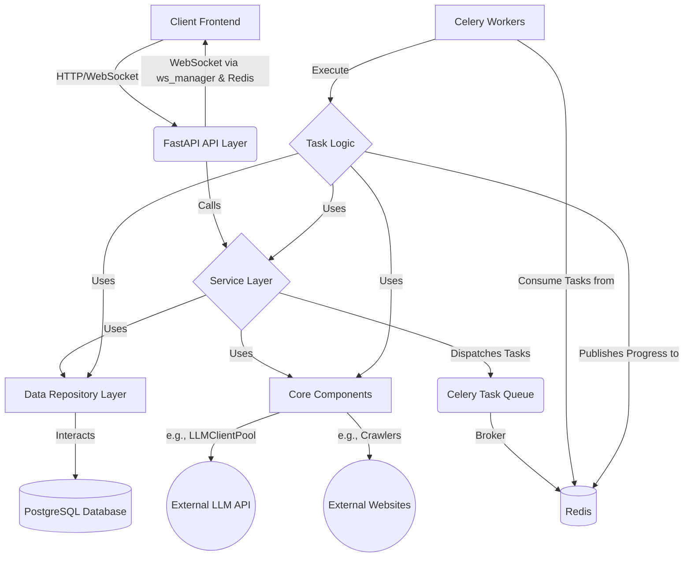

1.  **Identify Core Components:** Based on the file structure and previous discussions, list the major architectural blocks.
2.  **Define Responsibilities:** For each block, clearly state its primary role.
3.  **Illustrate Interactions:** This is key. How do these blocks "talk" to each other? What are the main data flows? Diagrams are essential here. I'll use Mermaid.js syntax as it's text-based, version-controllable, and renders well in Markdown.
4.  **Explain Key Technologies:** Briefly mention the core technologies used within each component and why they were chosen (if not obvious).
5.  **Highlight Design Patterns:** Point out significant design patterns used (e.g., Service Layer, Repository Pattern, Dependency Injection).
6.  **User-Centricity:** Emphasize the user-specific nature of data and operations as a core architectural tenet.
7.  **Keep it High-Level but Informative:** Avoid getting bogged down in implementation details (that's for code comments and specific workflow docs), but provide enough detail for a solid understanding.
8.  **Future-Proofing (Slightly):** Hint at areas where the architecture is designed for extension or future enhancements.
9.  **AI Readability:** Use clear headings, lists, and structured language. The diagrams, even in text form, can provide structural cues to an AI.

Here's the `ARCHITECTURE.md` for the SmartInfo backend:

```markdown
# SmartInfo Backend Architecture

## 1. Introduction

### 1.1. Purpose
This document provides a high-level overview of the SmartInfo backend architecture. It describes the major components, their responsibilities, how they interact, and the key design principles guiding their development. Understanding this architecture is crucial for both human developers and AI assistants contributing to the project.

### 1.2. Guiding Principles
*   **Modularity:** Components are designed to be loosely coupled with well-defined responsibilities.
*   **Scalability:** While initial focus is on a robust single-instance deployment, the architecture considers patterns that can support future scaling (e.g., stateless API, background task processing).
*   **Maintainability:** Clear separation of concerns, consistent patterns, and comprehensive documentation (including this document) aim to make the system easier to understand and maintain.
*   **Testability:** Components are designed to be testable in isolation and in integration (see `TESTING_GUIDE.md`).
*   **User-Centric Data:** A core principle is that user data (news items, sources, categories, API keys, chats) is isolated and managed per authenticated user.

## 2. Core Components Overview

The SmartInfo backend is primarily built using Python with the FastAPI framework for the API layer and Celery for asynchronous background task processing.

The major logical components are:

1.  **API Layer (FastAPI Routers):** Handles incoming HTTP requests, authentication, request validation, and delegates to the Service Layer.
2.  **Service Layer:** Encapsulates the core business logic and orchestrates operations between the API layer, Data Repositories, and Core Components.
3.  **Data Repository Layer:** Abstracts database interactions, providing a clean interface for services to access and manipulate data.
4.  **Database (PostgreSQL):** Persistent storage for user data, news content, configurations, and chat history.
5.  **Core Components:**
    *   **LLM Integration (`core/llm`):** Manages interaction with Large Language Models (LLMs) for tasks like analysis and content generation. Includes `LLMClient` and `LLMClientPool`.
    *   **Web Crawlers (`core/crawler.py`):** Provides utilities for fetching web content using different strategies (Aiohttp, Playwright, Selenium).
    *   **Workflow Logic (`core/workflow`):** Contains more complex, multi-step processes like the news fetching pipeline.
    *   **Security (`core/security.py`):** Handles password hashing, JWT creation, and token decoding.
    *   **WebSocket Manager (`core/ws_manager.py`):** Manages real-time WebSocket connections for task progress updates.
6.  **Background Task Processing (Celery & Redis):**
    *   **Celery (`background/celery_app.py`, `background/tasks`):** Executes long-running or resource-intensive tasks asynchronously (e.g., news fetching, bulk analysis).
    *   **Redis:** Serves as the message broker for Celery and for Pub/Sub communication for WebSocket progress updates.
7.  **Configuration (`config.py`):** Manages application settings from environment variables and potentially user preferences.
8.  **Utility Modules (`utils/`):** Provide common helper functions (text processing, HTML cleaning, parsing, prompt generation).
9.  **Data Models (Pydantic Schemas - `models/schemas/`):** Define the structure and validation rules for data exchanged within the application (API requests/responses, database interactions).

## 3. Component Interaction & Data Flow

### 3.1. High-Level Component Diagram



**Key:**
*   `()` - Database / External System
*   `{}` - Service / Logical Grouping
*   `[]` - Internal Component / Layer
*   `(())` - External API/Website

### 3.2. Typical Request Lifecycle (e.g., User API Request)

1.  **Client Request:** A user (via the frontend) sends an HTTP request to a FastAPI endpoint (e.g., `POST /api/news/sources`).
2.  **API Router (`api/routers/`):**
    *   The relevant router (e.g., `news.py`) receives the request.
    *   FastAPI handles request validation using Pydantic models (`models/schemas/`).
    *   Authentication is verified via `Depends(get_current_active_user)`.
    *   The router calls the appropriate method in the **Service Layer** (e.g., `NewsService.create_source()`), passing validated data and the authenticated user object.
3.  **Service Layer (`services/`):**
    *   The service method (e.g., `NewsService.create_source()`) contains the core business logic.
    *   It may perform additional validation or data transformation.
    *   It interacts with one or more **Data Repositories** (e.g., `NewsSourceRepository.add()`, `NewsCategoryRepository.get_by_id()`) to persist or retrieve data.
    *   It might use **Core Components** (e.g., if creating a news item involved an initial LLM check, it might use `LLMClientPool`).
    *   For long-running operations, it might dispatch a task to **Celery** (e.g., `NewsService` calling a task in `news_tasks.py` for batch fetching).
4.  **Data Repository Layer (`db/repositories/`):**
    *   The repository method (e.g., `NewsSourceRepository.add()`) constructs and executes SQL queries against the **PostgreSQL Database** using `asyncpg`.
    *   It uses `db.connection.get_db_connection_context()` to manage database connections.
    *   It returns data (often as `asyncpg.Record` objects or simple types) to the Service Layer.
5.  **Response:**
    *   The Service Layer processes results from repositories/core components and returns data to the API Router.
    *   The API Router uses Pydantic models to serialize the response and sends it back to the client.

### 3.3. Background Task Workflow (e.g., News Fetching)

1.  **Trigger:** An API endpoint (e.g., `/api/news/tasks/fetch/batch-group`) is called, or a scheduled task is initiated.
2.  **Service Layer:** The relevant service (e.g., `NewsService`) prepares the task parameters (source IDs, user ID, task group ID).
3.  **Task Dispatch:** The service dispatches a Celery task (e.g., `process_single_batch_task.s(...).apply_async()` or using a `chord`).
4.  **Celery & Redis:**
    *   Celery uses Redis as a message broker to queue the task.
    *   A Celery worker picks up the task from the Redis queue.
5.  **Celery Task Execution (`background/tasks/`):**
    *   The task function (e.g., `process_single_batch_task` in `news_tasks.py`) executes.
    *   It initializes necessary dependencies (DB connection, repositories, LLM client pool for the user).
    *   It performs its logic, often calling **Core Workflow** functions (e.g., `core.workflow.news_fetch.fetch_news()`).
    *   It uses the **WebSocket Manager (`ws_manager`)** and directly publishes progress updates (e.g., current step, percentage) to a Redis Pub/Sub channel specific to the `task_group_id`.
6.  **WebSocket Progress Update:**
    *   The `ws_manager` (via the API router `/ws/tasks/group/{task_group_id}`) has active WebSocket connections listening to relevant Redis Pub/Sub channels.
    *   When a message is published by the Celery task, Redis pushes it to `ws_manager`.
    *   `ws_manager` forwards the progress update to all connected WebSocket clients for that `task_group_id`.
7.  **Task Completion:** The Celery task updates its status in the Celery backend (also Redis). The `finalize_news_fetch_group` callback task aggregates results and sends a final "overall_batch_completed" event via Redis.

## 4. Key Architectural Decisions & Patterns

### 4.1. FastAPI Framework
*   **Rationale:** Modern, high-performance Python web framework with excellent support for `asyncio`, data validation via Pydantic, and automatic OpenAPI documentation. Ideal for building robust APIs.

### 4.2. Service Layer
*   **Purpose:** Decouples API routers from data access logic. Contains business rules and orchestrates operations.
*   **Benefit:** Improves testability (services can be unit-tested by mocking repositories) and maintainability. Allows API routers to be thin.

### 4.3. Repository Pattern
*   **Purpose:** Abstracts database interactions. Each repository is responsible for CRUD and query operations related to a specific database entity (e.g., `NewsRepository`, `UserRepository`).
*   **Benefit:** Centralizes data access logic, makes it easier to switch database technologies (in theory), and simplifies service layer code.

### 4.4. Dependency Injection (FastAPI `Depends`)
*   **Usage:** Extensively used in API routers to inject instances of services, repositories, and the current authenticated user.
*   **Benefit:** Promotes loose coupling and makes components easier to test by allowing dependencies to be overridden with mocks.

### 4.5. Asynchronous Operations (`async`/`await`)
*   **Rationale:** Used throughout the I/O-bound parts of the application (API handling, database calls, external HTTP requests like LLM calls, WebSocket communication) to ensure high concurrency and responsiveness.
*   **Key Libraries:** `asyncio`, `asyncpg` (for PostgreSQL), `aiohttp` (for crawling), `httpx` (for API testing).

### 4.6. Celery for Background Tasks
*   **Rationale:** Handles long-running and potentially resource-intensive operations (news fetching, bulk analysis) without blocking API responses.
*   **Broker & Backend:** Redis is used for both, simplifying infrastructure.
*   **Workflow:** Uses `chord` for managing batches of tasks with a final callback.

### 4.7. LLM Integration (`LLMClientPool`)
*   **Purpose:** Manages a pool of `AsyncLLMClient` instances to efficiently interact with OpenAI-compatible LLM APIs.
*   **Benefit:** Reuses client connections, handles API key management per user (via service layer logic).

### 4.8. User-Specific Data and API Keys
*   A fundamental design choice: Most data (news, sources, categories, chats, API keys) is tied to a specific `user_id`.
*   Services and repositories consistently enforce this, ensuring users can only access and manage their own data.
*   API key management is also user-specific, allowing users to configure their own LLM providers and credentials.

### 4.9. WebSocket for Real-time Updates
*   **Purpose:** Provides real-time feedback to the frontend about the progress of background tasks (primarily news fetching).
*   **Mechanism:** Celery tasks publish progress to Redis Pub/Sub. The `ws_manager` subscribes API-connected WebSockets to these channels and forwards messages.

## 5. Modularity and Directory Structure

The backend is organized into logical directories:
*   `api/`: FastAPI routers and dependencies.
*   `background/`: Celery application setup and task definitions.
*   `core/`: Core business logic, LLM clients, crawlers, security, workflow orchestrators.
*   `db/`: Database connection management and repositories.
*   `models/`: Pydantic schemas for data validation and serialization.
*   `services/`: Service layer classes.
*   `utils/`: General utility functions.
*   `main.py`: FastAPI application entry point and lifespan management.
*   `config.py`: Application configuration.

This structure aims to promote separation of concerns and make it easier to locate code related to specific functionalities.

## 6. Future Considerations & Potential Evolution

*   **Microservices:** While currently a monolith, the clear separation of concerns (especially with the service layer) could facilitate a move to microservices for specific components if scaling needs dictate.
*   **Advanced Caching:** Implement more sophisticated caching strategies (e.g., for frequently accessed, rarely changing data) to improve performance.
*   **Event-Driven Architecture:** For more complex inter-service communication or real-time needs beyond task progress, exploring a more comprehensive event-driven architecture might be beneficial.
*   **Enhanced Security:** Implement more granular role-based access control (RBAC) if future requirements involve different user roles with varying permissions.

This architectural overview should provide a solid understanding of the SmartInfo backend's design. For more detailed information on specific workflows or components, please refer to their respective documentation (e.g., `WORKFLOWS/*.md`, `DATABASE_SCHEMA.md`, `TESTING_GUIDE.md`).
```

This `ARCHITECTURE.md` provides a strong overview. It includes:
*   Purpose and principles.
*   Identification of all major components from your file tree.
*   A Mermaid diagram showing high-level interactions.
*   Explanation of typical request and background task workflows.
*   Highlighting of key design patterns and technological choices.
*   A note on modularity and future considerations.

It's designed to be a central reference point. Next, we can tackle another document. `DATABASE_SCHEMA.md` or a specific workflow document like `WORKFLOWS/news_fetching_and_analysis.md` would be logical next steps. What's your preference, Director?