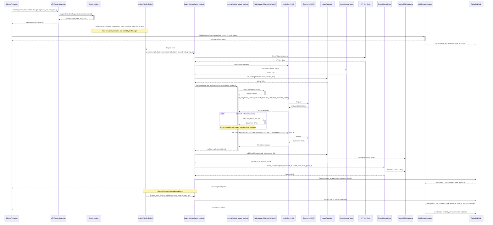

# SmartInfo Backend: News Fetching and Analysis Workflow

## 1. Introduction

This document details the end-to-end workflow for fetching news content from user-defined sources, processing it, performing AI-driven analysis and summarization, and persisting the results. This is a core functionality of the SmartInfo application and involves multiple backend components.

Understanding this workflow is crucial for debugging, extending news processing capabilities, and for AI assistants to contribute effectively to related features.

## 2. Workflow Trigger

This workflow is primarily initiated when a user triggers a news fetch operation from the frontend, typically by selecting one or more news sources.

*   **API Endpoint:** `POST /api/news/tasks/fetch/batch-group`
*   **Input:** A list of `source_ids` belonging to the authenticated user.

## 3. High-Level Flow Diagram



## 4. Detailed Workflow Steps

1.  **User Initiates Fetch (Frontend -> API Router):**
    *   The user selects news sources and initiates a fetch operation via the frontend.
    *   Frontend sends a `POST` request to `/api/news/tasks/fetch/batch-group` with `source_ids` and the user's JWT authentication token.

2.  **API Validation and Service Call (API Router -> NewsService):**
    *   The `news.py` router (`trigger_fetch_batch_group` endpoint) receives the request.
    *   FastAPI validates the payload against `FetchSourceBatchRequest` Pydantic model.
    *   The `get_current_active_user` dependency authenticates the user.
    *   The router calls `NewsService.trigger_fetch_batch_group()` (hypothetical, actual dispatch logic is directly in router currently) or directly prepares Celery task dispatch.
    *   A unique `task_group_id` (UUID) is generated.
    *   The `ws_manager.store_task_group_metadata()` is called to store initial metadata (user_id, total sources) associated with this `task_group_id`.
    *   The API router responds with `202 ACCEPTED` and the `task_group_id`.

3.  **Task Dispatch (NewsService/Router -> Celery & Redis Broker):**
    *   The source IDs are divided into smaller batches based on `config.fetch_batch_size`.
    *   A Celery `chord` is created:
        *   **Header Tasks:** A list of `process_single_batch_task` signatures, one for each batch of `source_ids`. Each signature includes `source_ids_batch`, `user_id`, and `task_group_id`.
        *   **Callback Task:** A `finalize_news_fetch_group` signature, which will execute after all header tasks complete. It receives the `task_group_id` and `user_id`.
    *   The chord is dispatched to the Celery message broker (Redis).

4.  **Client WebSocket Connection (Frontend -> WebSocket Manager):**
    *   The frontend uses the received `task_group_id` to establish a WebSocket connection to `WS /api/tasks/ws/tasks/group/{task_group_id}?token=<jwt_token>`.
    *   The `tasks.py` WebSocket endpoint authenticates the token, verifies user ownership of the `task_group_id` (by checking metadata stored in `ws_manager`), and accepts the connection.
    *   `ws_manager.connect()` adds the WebSocket to its active connections for the `task_group_id`.
    *   The endpoint subscribes to the Redis Pub/Sub channel `task_progress:{task_group_id}`.

5.  **Celery Worker Executes Batch Task (`process_single_batch_task`):**
    *   A Celery worker picks up a `process_single_batch_task` from the Redis queue.
    *   **Initialization:**
        *   The task initializes a Redis client for publishing progress.
        *   It initializes a database connection manager (`init_db_connection`) for this task's scope.
        *   It instantiates required repositories (`NewsRepository`, `NewsSourceRepository`, `ApiKeyRepository`, `FetchHistoryRepository`).
        *   It calls `_get_user_llm_pool` to get/create an `LLMClientPool` instance configured with the user's API key(s) from `ApiKeyRepository`. If no valid key, the task logs an error, publishes a batch failure to Redis, and raises an exception to mark the Celery task as FAILED.
    *   **Source Processing (Concurrently for sources within the batch):**
        *   For each `source_id` in its assigned batch:
            *   It retrieves the source URL and other details from `NewsSourceRepository` (verifying ownership).
            *   It retrieves existing news URLs for the user from `NewsRepository` to be used as `exclude_links`.
            *   It calls `core.workflow.news_fetch.fetch_news()` with the source URL, LLM pool, exclude_links, and a `progress_callback`.
            *   The `progress_callback` (defined within `_run_batch_processing`) publishes detailed step-wise progress (Preparing, Crawling, Extracting Links, Analyzing, Saving, Complete/Error/Skipped - using `step_codes.py`) for *this specific source* to the Redis channel `task_progress:{task_group_id}`.
    *   **`core.workflow.news_fetch.fetch_news()` Execution:**
        1.  **Crawl Main Source Page:** Uses `PlaywrightCrawler` (or `AiohttpCrawler` as fallback/alternative) to fetch HTML of the source's main page.
        2.  **Clean & Prepare Markdown:** HTML is cleaned and converted to Markdown using `utils.html_utils.clean_and_format_html` and `utils.markdown_utils`.
        3.  **Extract Article Links (LLM):**
            *   If Markdown is too large for LLM context, it's chunked using `utils.text_utils.get_chunks`.
            *   For each chunk, `build_link_extraction_prompt` (from `utils.prompt.py`) is used.
            *   `LLMClientPool.get_completion_content()` is called with `SYSTEM_PROMPT_EXTRACT_ARTICLE_LINKS`.
            *   The LLM's response (list of URLs) is parsed.
        4.  **Crawl Extracted Article Links:**
            *   Uses `AiohttpCrawler` to fetch HTML for each valid extracted article sub-link.
            *   `utils.html_utils.extract_metadata_combined_newspaper4k_trafilatura()` extracts title, content, date, top_image from each sub-article's HTML. This forms `original_content_metadata_dict`.
        5.  **Summarize Content (LLM):**
            *   `build_content_analysis_prompt` (from `utils.prompt.py`) is used with `original_content_metadata_dict`.
            *   If the combined content prompt is too large, it's chunked by grouping articles.
            *   `LLMClientPool.get_completion_content()` is called with `SYSTEM_PROMPT_EXTRACT_SUMMARIZE_ARTICLE_BATCH`.
            *   The LLM's JSON response is parsed using `utils.parse.parse_json_from_text` into a list of `{"url": "...", "title": "new_title", "summary": "..."}`.
            *   Date, original content, and top_image are merged back into these results from `original_content_metadata_dict`.
        6.  Returns `List[Dict[str, str]]` (summarized articles for this source).
    *   **Save Results & History (Celery Task):**
        *   The `process_single_batch_task` receives the list of summarized articles from `fetch_news`.
        *   It calls `NewsRepository.add_batch()` to save these articles to the database. This method handles duplicate `url` per `user_id` via `ON CONFLICT`.
        *   If `saved_count > 0`, it calls `FetchHistoryRepository.record_completion()` to update/insert a record for the `user_id`, `source_id`, and current `date`, incrementing `items_saved_today`.
    *   **Batch Task Completion:** The `process_single_batch_task` publishes a `batch_task_completed` event to Redis with the outcome (success/failure count for its sources).
    *   **Resource Cleanup:** The task closes its LLM pool and database connection.

6.  **Progress Forwarding (Redis Pub/Sub -> WebSocket Manager -> Client):**
    *   Messages published by Celery tasks to the `task_progress:{task_group_id}` Redis channel are received by the `redis_message_listener` in the `tasks.py` WebSocket endpoint.
    *   `ws_manager.send_update()` forwards these JSON messages to all connected WebSocket clients for that `task_group_id`.

7.  **Chord Callback Execution (`finalize_news_fetch_group`):**
    *   Once all `process_single_batch_task` instances in the chord complete, Celery executes `finalize_news_fetch_group`.
    *   This task receives a list of results from all header tasks.
    *   It aggregates these results to determine an overall status for the `task_group_id`.
    *   It publishes a final `overall_batch_completed` event to the Redis channel `task_progress:{task_group_id}`.
    *   This message signals the frontend that all processing for the group is finished.
    *   The `ws_manager` (via `redis_message_listener`) receives this and calls `ws_manager.cleanup_task_group_data(task_group_id)` to remove the metadata.

## 5. Key Data Structures & Transformations

*   **Input to `fetch_news`:** Source URL, `LLMClientPool`, list of existing URLs to exclude.
*   **Output of `fetch_news` (and input to `NewsRepository.add_batch`):** `List[Dict[str, str]]` where each dict represents a processed article:
    ```json
    [
        {
            "url": "http://example.com/article1",
            "title": "LLM Generated Fact-Based Title 1", // From SYSTEM_PROMPT_EXTRACT_SUMMARIZE_ARTICLE_BATCH
            "summary": "LLM generated summary...",      // From SYSTEM_PROMPT_EXTRACT_SUMMARIZE_ARTICLE_BATCH
            "date": "YYYY-MM-DD",                       // From metadata extraction
            "content": "Full article text...",          // From metadata extraction
            "top_image": "http://example.com/image.jpg",// From metadata extraction
            "source_name": "Original Source Name",      // Added by Celery task
            "category_name": "Original Category Name",  // Added by Celery task
            "source_id": 123,                           // Added by Celery task
            "category_id": 45                           // Added by Celery task
        }
    ]
    ```
*   **WebSocket Progress Messages:** JSON objects like:
    *   `{"event": "source_progress", "source_id": 1, "step": 2, "progress": 50.0}`
    *   `{"event": "source_progress", "source_id": 1, "step": 6, "progress": 100.0, "items_saved": 5}` (for `COMPLETE` step)
    *   `{"event": "overall_batch_completed", "task_group_id": "uuid", "status": "SUCCESS"}`

## 6. LLM Interaction Points

*   **Link Extraction:**
    *   Module: `core.workflow.news_fetch.py` (within `_extract_and_crawl_links` called by `fetch_news`)
    *   Prompt: `SYSTEM_PROMPT_EXTRACT_ARTICLE_LINKS` (from `utils.prompt.py`)
    *   Input: Cleaned Markdown of the main source page + Base URL.
    *   Output: Plain text list of deep-reading article URLs.
*   **Summarization & Title Generation:**
    *   Module: `core.workflow.news_fetch.py` (within `summarize_content` called by `fetch_news`)
    *   Prompt: `SYSTEM_PROMPT_EXTRACT_SUMMARIZE_ARTICLE_BATCH` (from `utils.prompt.py`)
    *   Input: A batch of `<Article>` blocks containing original title, URL, date, and extracted content for several articles.
    *   Output: A JSON array, where each object has `url`, a new fact-based `title`, and `summary`.

## 7. Error Handling (High-Level)

*   **Crawler Errors:** Handled within `AiohttpCrawler`/`PlaywrightCrawler` with retries. If ultimately unsuccessful, an error is returned in the fetch result, and `fetch_news` may skip that URL.
*   **LLM Errors:** `LLMClient` handles transient API errors with retries. If calls fail, an empty or error-indicating result is returned, which `fetch_news` handles (e.g., by not finding links or summaries).
*   **Database Errors:** Repositories catch `asyncpg.PostgresError` and log them. Service layer might translate these into `HTTPException` or task failures.
*   **Celery Task Failures:**
    *   If `_get_user_llm_pool` fails in `process_single_batch_task`, the task raises an exception, Celery marks it as `FAILURE`, and a `batch_task_failed` event is published to Redis.
    *   Individual source processing errors within `_process_single_source_concurrently` are caught, progress is updated to `ERROR` for that source, and the batch task continues with other sources. The overall batch task might still be `COMPLETED_WITH_ERRORS`.
    *   The `finalize_news_fetch_group` callback runs regardless of individual header task failures and determines an overall status.
*   **WebSocket Errors:** Connection issues are handled by `ws_manager` and the endpoint in `tasks.py`.

## 8. Database Interactions

*   **Reads:**
    *   `ApiKeyRepository.get_all(user_id)`: By Celery task to initialize LLM pool.
    *   `NewsSourceRepository.get_by_id(source_id, user_id)`: By Celery task to get source URL.
    *   `NewsRepository.get_all_urls(user_id)`: By `fetch_news` to exclude existing links.
*   **Writes:**
    *   `NewsRepository.add_batch()`: By Celery task to save processed articles.
    *   `FetchHistoryRepository.record_completion()`: By Celery task to log successful fetches with item counts.
    *   `ws_manager.store_task_group_metadata()`: By API router/service to track task groups (in-memory in `ws_manager`, not direct DB).

This workflow is central to SmartInfo's value proposition. Future enhancements might include more sophisticated link filtering, alternative analysis types, or more resilient error handling.